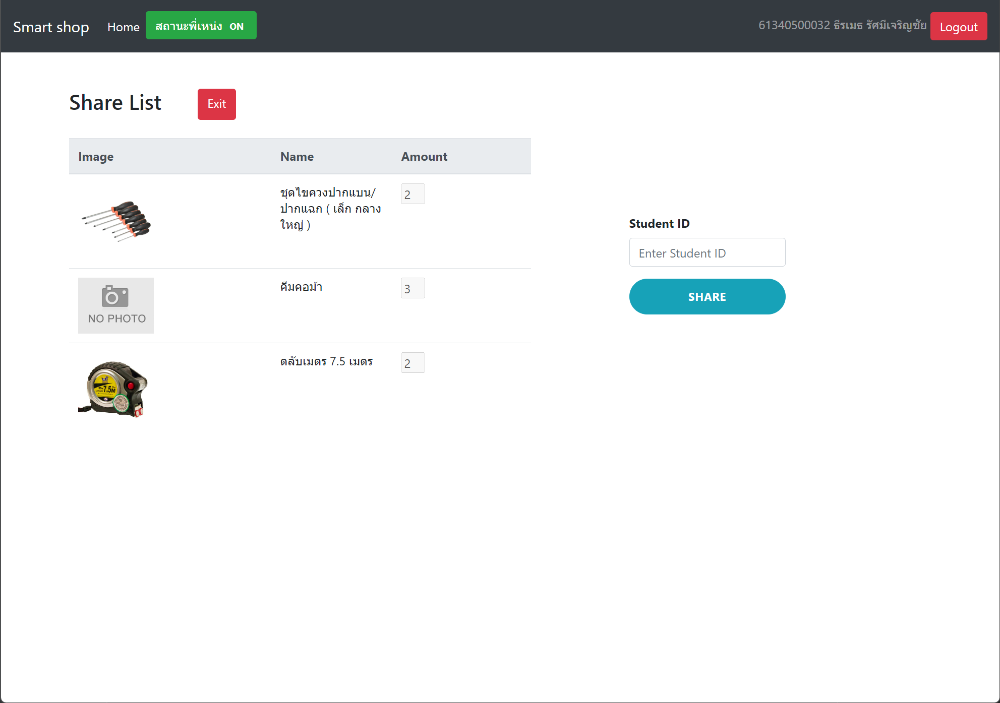

# Smart Shop
**Smart Shop** is an **Inventory Management System** developed using Flask and SQLAlchemy

### Prerequisites
```shell
mkvirtualenv smart_shop
workon smart_shop
pip install -r requirements.txt
```
```shell
flask --app finalProject run --host=0.0.0.0
```





