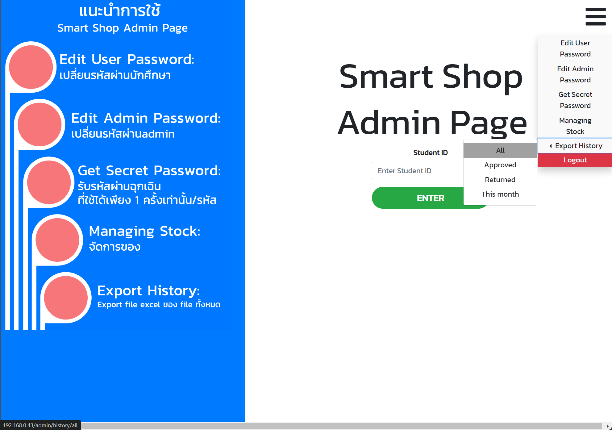
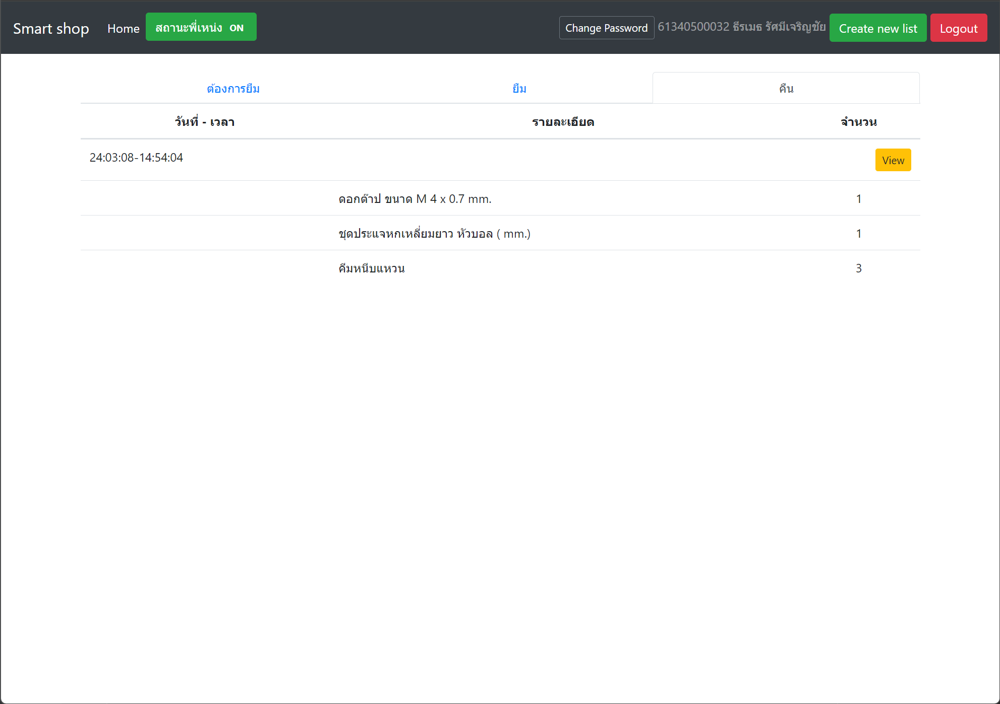

# Smart Shop
**Smart Shop** is an **Inventory Management System** developed using Flask and SQLAlchemy

### Prerequisites
```shell
mkvirtualenv smart_shop
workon smart_shop
pip install -r requirements.txt
```

### Setup database
```shell
# Create database table
python database_setup.py
# generate users list
python gen_student.py
# generate assets list
python gen_tool.py
# generate create/request/approve events
python gen_list.py
```

### Bring up the server
```shell
# Use Flask to run with port 5000
flask --app finalProject run --host=0.0.0.0
# Or use system Python3 to run with port 80
sudo python3 finalProject.py
```








